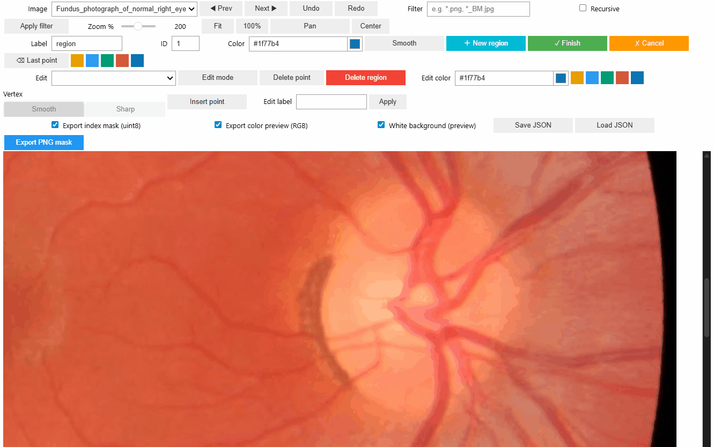

# Poly Mask Annotator for Jupyter

> **Purpose**  
> A copy‑and‑paste friendly, offline‑first polygon mask annotator that runs **entirely in Jupyter** (ipywidgets + ipycanvas).  
> Built for **casual segmentation tasks** and for **secure environments** (e.g., university clusters) where **data must not leave** the machine.



**Current version:** v1.8.2

- 🖱️ Draw & Edit polygons: add/move/delete/insert vertex
- ✨ Chaikin smoothing with per‑vertex **Smooth/Sharp** preservation
- 🔍 Robust zoom: slider / **Fit** / **100%** / **mouse‑wheel** (configurable range)
- 🧭 Pan options: traditional canvas pan **or** **drag‑scroll viewport** (no redraw)
- 💾 Sidecar **JSON** per image (auto save/load)
- 🖼️ Export: **uint8 index mask** + **RGB color preview**
- 🧰 Scrollable viewport that prevents aspect‑ratio distortion from parent layout

## New in v1.8.2

- **Polyline (open path) support**  
  - Toggle **Type: Area / Polyline** before drawing.  
  - **Area** (closed polygon): behaves as before — fill + stroke, exported as filled mask.  
  - **Polyline** (open path): Finish leaves the region open — drawn as a stroked line only, exported as a 1-px wide line mask.  
  - JSON sidecars now preserve `open_path`.  
  - Edit mode: open paths are selected by clicking near a line segment (~6 px tolerance).  
  - Insert/Delete point logic handles open vs. closed correctly.  
- **Toolbar layout update**  

---

## Why this tool?

- **Offline / air‑gapped friendly**: No web calls. Works where packages can be installed locally or pre‑staged.
- **Zero server setup**: Runs inside a notebook. No Qt, no desktop GUI, no ports to expose.
- **Copy‑and‑paste UX**: Minimal boilerplate to get started; optional JS snippet enables no‑redraw panning.

---

## Requirements

- Python **3.9–3.11** (recommended)
- JupyterLab **4** or Notebook **7** (ipywidgets v8-ready)
- Packages:
  - `ipywidgets >= 8.0.0`
  - `ipycanvas >= 0.13.0`
  - `Pillow >= 10.0.0`
  - `scikit-image >= 0.21.0`
  - `numpy >= 1.24.0`

> **Older Jupyter** (e.g., JupyterLab 3) can work but may require the prebuilt `jupyterlab-widgets` extension.  
> For best results, prefer JupyterLab 4 or Notebook 7.

### Install (online)

```bash
pip install -U ipywidgets ipycanvas pillow scikit-image numpy
```

### Install (offline / cluster)

1. On a networked machine, build a wheelhouse:
   ```bash
   mkdir wheelhouse
   pip download -d wheelhouse ipywidgets ipycanvas pillow scikit-image numpy
   ```
2. Move `wheelhouse/` to the cluster.
3. On the cluster:
   ```bash
   pip install --no-index --find-links=wheelhouse ipywidgets ipycanvas pillow scikit-image numpy
   ```

> **Tip (legacy CPU optimization on Linux/x86_64):**
> ```bash
> pip uninstall -y pillow
> pip install --upgrade --force-reinstall pillow-simd
> ```

---

## Quickstart (copy‑paste)

> Save `poly_mask_annotator.py` (from this repo) next to your notebook, then paste:

```python
from IPython.display import HTML
HTML(\"\"\"
<style>
.pm-wheel-passive { touch-action: auto; overscroll-behavior: auto; }
/* Optional: cursor for drag-scroll pan */
.pm-drag-scroll.pm-drag-scroll-active { cursor: grab; }
.pm-drag-scroll.pm-drag-scroll-active:active { cursor: grabbing; }
</style>
<script>
/* Optional: enable "drag-scroll viewport" (no redraw) when Pan is ON */
(function(){
  function enableDragScroll(root){
    if (!root || root.__pmDragScrollInstalled) return;
    root.__pmDragScrollInstalled = true;
    root.addEventListener('pointerdown', function(e){
      if (!root.classList.contains('pm-drag-scroll-active')) return;
      if (e.button !== 0) return; // left only
      const startX = e.clientX + root.scrollLeft;
      const startY = e.clientY + root.scrollTop;
      root.setPointerCapture && root.setPointerCapture(e.pointerId);
      const move = ev => { root.scrollLeft = startX - ev.clientX; root.scrollTop = startY - ev.clientY; };
      const up   = ev => { root.removeEventListener('pointermove', move); root.removeEventListener('pointerup', up); };
      root.addEventListener('pointermove', move); root.addEventListener('pointerup', up);
      e.preventDefault();
    }, true);
  }
  const applyAll = () => document.querySelectorAll('.pm-drag-scroll').forEach(el => enableDragScroll(el));
  const obs = new MutationObserver(applyAll);
  obs.observe(document.body, {subtree: true, childList: true}); applyAll();
})();
</script>
\"\"\")

from poly_mask_annotator import MaskAnnotator

ui = MaskAnnotator(
    folder=\"/path/to/images\",   # ← change this
    enable_wheel_zoom=True,
    viewport_height=\"70vh\",     # or leave None and use viewport_max_height=\"80vh\"
    min_zoom_pct=10, max_zoom_pct=400,
    pan_via_scroll=True,          # Pan ON → left-drag the viewport (no redraw)
)
ui
```

> If your environment blocks inline JS execution, `pan_via_scroll` will simply have no effect; regular pan still works.

---

## Data model & outputs

- **Allowed image types**: `.jpg`, `.jpeg`, `.png`, `.bmp`, `.tif`, `.tiff`
- **Sidecar JSON**: `<image_stem>.json` saved next to each image (auto save/load)
  - Stores: regions (label, label_id, color, smoothing, points, sharp vertices)
  - JSON's image size must match the image's size
- **Export**:
  - `<stem>_mask.png` — **uint8** index mask (background=0, region uses `label_id`)
  - `<stem>_mask_color.png` — RGB color preview (white/black background toggle)
- **Overlaps**: Later regions overwrite earlier ones on export

---

## UI & Controls

### Draw a new region
- Click **＋ New region** → **left‑click** to add vertices
- **Right‑click** or **⌫ Last point** to remove the last vertex
- Click near the **first vertex** or click **✓ Finish** to close (need ≥ 3 points)
- **Cancel** discards the polygon and **restores exact pre‑draw state** (snapshot)
- **Smooth** applies Chaikin smoothing; later mark per‑vertex **Sharp** in Edit mode

### Edit regions
- Enable **Edit mode** → choose a region in **Edit** dropdown
- **Drag** a vertex to move; **Delete point** removes selected vertex
- **Insert point** ON → click an edge to insert the closest‑projection vertex
- Switch **Vertex: Smooth/Sharp** per vertex; change color/label via UI
- **Delete region** removes the polygon

### Zoom & Pan
- Configurable zoom range (`min_zoom_pct..max_zoom_pct`)
- Zoom via slider, **Fit**, **100%**, **mouse‑wheel** (`enable_wheel_zoom=True`)
- Pan via **Pan toggle + drag**, or with the optional JS: **drag‑scroll the viewport** (no redraw)
- **Center** resets pan offsets

### File filter & navigation
- Glob patterns (e.g., `*.png`, `*_mask.jpg`, `A*.*`); **Recursive** to search subfolders
- `[JSON]` mark appears in the image dropdown when a sidecar JSON is detected

### Undo/Redo
- Available for most editing actions (kept in memory; ~200 states)

---

## Constructor (API)

```python
MaskAnnotator(
    folder: str,
    max_display: int = 1000,
    allow_color_preview_export: bool = True,
    enable_wheel_zoom: bool = False,
    edge_margin_px: int = 48,
    file_filter: str = "",
    recursive: bool = False,
    show_scrollbars: bool = True,
    viewport_max_height: str = "80vh",
    viewport_height: str | None = None,   # e.g., "70vh" or "600px"
    min_zoom_pct: int = 10,
    max_zoom_pct: int = 400,
    pan_via_scroll: bool = False,
)
```

- `viewport_height` fixes the viewport height (scrollable). If `None`, `viewport_max_height` acts as a maximum.
- `enable_wheel_zoom=False` if you prefer page scrolling to stay active.
- `edge_margin_px` allows placing vertices slightly outside the image.

---

## Performance tips

- Ensure browser **GPU acceleration** is ON (e.g., `chrome://gpu`)
- Keep **ipycanvas / ipywidgets** up to date
- Prefer opening the notebook **in your local browser** even if the kernel is remote
- For very large images, consider lossless **downscaling** for annotation; export quality is driven by polygon geometry

---

## Security & privacy

- No telemetry; no web calls. Data stays inside your environment.
- JSON/PNGs are written **next to the images** (ensure write permission).
- If inline JS is blocked, the tool still works; only drag‑scroll pan is disabled.

---

## Troubleshooting

- **Nothing renders** → Verify ipywidgets/ipycanvas versions; use JupyterLab 4 / Notebook 7; restart kernel.
- **Right‑click doesn’t work** (trackpad config) → Use **⌫ Last point** button instead.
- **Slow zoom/pan** → Check GPU acceleration; update ipycanvas; for legacy CPU try `pillow-simd` on Linux/x86_64.

---

## License

MIT (see `LICENSE`).

---

## Acknowledgements

- Built on **ipywidgets** and **ipycanvas**
- Okabe–Ito color palette
- Polygon rasterization by `skimage.draw.polygon`
